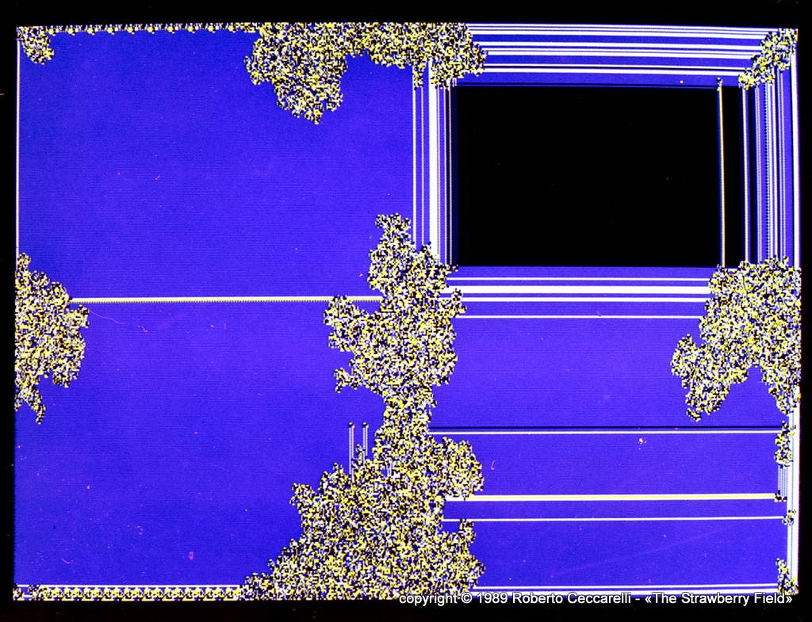

# Tur-miti
(Ri)creazioni al calcolatore: Macchine di Turing bidimensionali e tur-miti lasciano tracce su un piano 

## Cosa sono le tur-miti

***«Nessun organismo, se si esclude l'uomo, modifica l'aspetto di un paesaggio come le termiti.»***   
WALTER LIN5ENMAIER, *Insects of the World* 

Con questa citazione A. K. Dewdney inizia la rubrica (Ri)creazioni al calcolatore su Le Scienze n.254 dell'ottobre 1989.  

Chi volesse leggere [l'articolo originale può trovarlo su Internet Archive](https://archive.org/details/lescienze-254/page/n37/mode/2up).

In buona sostanza si tratta di una [Macchina di Turing](https://it.wikipedia.org/wiki/Macchina_di_Turing) bidimensionale che
ad ogni ciclo si muove su una diversa cella e la colora a seconda dello stato.

L'operazione produce immagini che possono passare dal caotico al regolare (o viceversa).

## Questo repository

Recentemente mi sono interessato alla fotografia in formato *carte de visite* per la quale ho [realizzato dei tools](https://github.com/strawberryfield/Contemporary_CDV)
e cercando delle vecchie fotografie sono incappato in queste delle turmiti.

Avevo infatti realizzato il programma presente in questo repository che avevo anche inviato alla rivista MCmicrocomputer ([qui la lettera di presentazione originale](docs/intelligiochi.htm)) e che avevo avuto l'onore di veder [citato nella rubrica Intelligiochi del numero 91](https://strawberryfield.altervista.org/mc/mc91articolo.pdf) il successivo mese di dicembre.

Ho recuperato il floppy originale e l'ho salvato in questo repository, assieme alla documentazione,
[convertita da WordStar con questo programma](https://strawberryfield.altervista.org/blog/wsconvert.php) che 
avevo realizzato per un altro scopo.

## Turmiti 2021

Nella cartella **Turmiti2021** è presente una versione Windows del programma scritta in C# per Net 5.0
che può utilizzare le vecchie tabelle delle regole.